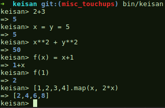

# Keisan

[](https://badge.fury.io/rb/keisan)
[](https://travis-ci.org/project-eutopia/keisan)
[](https://opensource.org/licenses/MIT)
[](https://hakiri.io/github/project-eutopia/keisan)

Keisan ([計算, to calculate](https://en.wiktionary.org/wiki/%E8%A8%88%E7%AE%97#Japanese)) is a Ruby library for parsing equations into an abstract syntax tree.  This allows for safe evaluation of string representations of mathematical/logical expressions.

## Installation

Add this line to your application's Gemfile:

```
gem 'keisan'
```

And then execute:

    $ bundle

Or install it yourself as:

    $ gem install keisan

## Usage

### REPL

The command `bin/keisan` will open up an interactive REPL.  The commands you type in to this REPL are relayed to an internal `Keisan::Calculator` class and displayed back to you.



### Calculator class

The functionality of `keisan` can be demonstrated by using the `Keisan::Calculator` class.  The `evaluate` method evaluates an expression by parsing it into an abstract syntax tree (AST), then evaluating any member functions/variables given.  There is also a `simplify` method that allows undefined variables and functions to exist, and will just return the simplified AST.

```ruby
calculator = Keisan::Calculator.new
calculator.evaluate("15 + 2 * (1 + 3)")
#=> 23
calculator.simplify("1*(0*2+x*g(t))").to_s
#=> "x*g(t)"
```

For users who want access to the parsed abstract syntax tree, you can use the `ast` method to parse any given expression.

```ruby
calculator = Keisan::Calculator.new
ast = calculator.ast("x**2+1")
ast.to_s
#=> "(x**2)+1"
ast.class
#=> Keisan::AST::Plus
ast.children[0].class
#=> Keisan::AST::Exponent
ast.children[0].children[0].class
#=> Keisan::AST::Variable
ast.children[0].children[0].name
#=> "x"
ast.children[0].children[1].class
#=> Keisan::AST::Number
ast.children[0].children[1].value
#=> 2
ast.children[1].class
#=> Keisan::AST::Number
ast.children[1].value
#=> 1
```

##### Specifying variables

Passing in a hash of variable (`name`, `value`) pairs to the `evaluate` method defines variables

```ruby
calculator = Keisan::Calculator.new
calculator.evaluate("3*x + y**2", x: -2.5, y: 3)
#=> 1.5
```

It will raise an error if an variable is not defined

```ruby
calculator = Keisan::Calculator.new
calculator.evaluate("x + 1")
#=> Keisan::Exceptions::UndefinedVariableError: x
```

It is also possible to define variables in the string expression itself

```ruby
calculator = Keisan::Calculator.new
calculator.evaluate("x = 10*n", n: 2)
calculator.evaluate("3*x + 1")
#=> 61
```

##### Specifying functions

Just like variables, functions can be defined by passing a `Proc` object as follows

```ruby
calculator = Keisan::Calculator.new
calculator.evaluate("2*f(1+2) + 4", f: Proc.new {|x| x**2})
#=> 22
```

It will raise an error if a function is not defined

```ruby
calculator = Keisan::Calculator.new
calculator.evaluate("f(2) + 1")
#=> Keisan::Exceptions::UndefinedFunctionError: f
```

Note that functions work in both regular (`f(x)`) and postfix (`x.f()`) notation.  The postfix notation requires the function to take at least one argument.  In the case of `a.f(b,c)`, this is translated internally to `f(a,b,c)`.  If there is only a single argument to the function, the braces can be left off: `x.f`.

```ruby
calculator = Keisan::Calculator.new
calculator.evaluate("[1,3,5,7].size()")
#=> 4
calculator.evaluate("[1,3,5,7].size")
#=> 4
```

It is even possible to do more complicated things like follows

```ruby
calculator = Keisan::Calculator.new
calculator.define_function!("f", Proc.new {|x| [[x-1,x+1], [x-2,x,x+2]]})
calculator.evaluate("4.f")
#=> [[3,5], [2,4,6]]
calculator.evaluate("4.f[0]")
#=> [3,5]
calculator.evaluate("4.f[0].size")
#=> 2
calculator.evaluate("4.f[1]")
#=> [2,4,6]
calculator.evaluate("4.f[1].size")
#=> 3
```

Like variables, it is also possible to define functions in the string expression itself.

```ruby
calculator = Keisan::Calculator.new
calculator.evaluate("f(x) = n*x", n: 10) # n is local to this definition only
calculator.evaluate("f(3)")
#=> 30
calculator.evaluate("f(0-a)", a: 2)
#=> -20
calculator.evaluate("n") # n only exists in the definition of f(x)
#=> Keisan::Exceptions::UndefinedVariableError: n
```

This form even supports recursion, but you must explicitly allow it.

```ruby
calculator = Keisan::Calculator.new
calculator = Keisan::Calculator.new(allow_recursive: false)
calculator.evaluate("my_fact(n) = if (n > 1, n*my_fact(n-1), 1)")
#=> Keisan::Exceptions::InvalidExpression: Unbound function definitions are not allowed by current context

calculator = Keisan::Calculator.new(allow_recursive: true)
calculator.evaluate("my_fact(n) = if (n > 1, n*my_fact(n-1), 1)")
calculator.evaluate("my_fact(0)")
#=> 1
calculator.evaluate("my_fact(1)")
#=> 1
calculator.evaluate("my_fact(2)")
#=> 2
calculator.evaluate("my_fact(5)")
#=> 120
```

##### Lists

Just like in Ruby, lists can be defined using square brackets, and indexed using square brackets

```ruby
calculator = Keisan::Calculator.new
calculator.evaluate("[2, 3, 5, 8]")
#=> [2, 3, 5, 8]
calculator.evaluate("[[1,2,3],[4,5,6],[7,8,9]][1][2]")
#=> 6
```

They can also be concatenated using the `+` operator

```ruby
calculator = Keisan::Calculator.new
calculator.evaluate("[3, 5] + [x, x+1]", x: 10)
#=> [3, 5, 10, 11]
```

Keisan also supports the basic functional programming operators `map` (or `collect`), `filter` (or `select`), and `reduce` (or `inject`).

```ruby
calculator = Keisan::Calculator.new
calculator.evaluate("map([1,3,5], x, 2*x)")
#=> [2,6,10]
calculator.simplify("[1,3,5].map(x, y*x**2)").to_s
#=> "[y,9*y,25*y]"
calculator.evaluate("select([1,2,3,4], x, x % 2 == 0)")
#=> [2,4]
calculator.evaluate("[-2,-1,0,1,2].filter(x, x > 0)")
#=> [1,2]
calculator.evaluate("[1,2,3,4,5].inject(1, total, x, total*x)")
#=> 120
```

##### Logical operations

`keisan` understands basic boolean logic operators, like `<`, `<=`, `>`, `>=`, `&&`, `||`, `!`, so calculations like the following are possible

```ruby
calculator = Keisan::Calculator.new
calculator.evaluate("1 > 0")
#=> true
calculator.evaluate("!!!true")
#=> false
calculator.evaluate("x >= 0 && x < 10", x: 5)
#=> true
```

There is also a useful ternary `if` function defined

```ruby
calculator = Keisan::Calculator.new
calculator.evaluate("2 + if(1 > 0, 10, 29)")
#=> 12
```

##### Bitwise operations

The basic bitwise operations, NOT `~`, OR `|`, XOR `^`, and AND `&` are also available for use

```ruby
calculator = Keisan::Calculator.new
calculator.evaluate("2 + 12 & 7")
#=> 6
```

##### String

`keisan` also can parse in strings, and access the characters by index

```ruby
calculator = Keisan::Calculator.new
calculator.evaluate("'hello'[1]")
#=> "e"
```

##### Binary, octal, and hexadecimal numbers

Using the prefixes `0b`, `0o`, and `0x` (standard in Ruby) indicates binary, octal, and hexadecimal numbers respectively.

```ruby
calculator = Keisan::Calculator.new
calculator.evaluate("0b1100")
#=> 12
calculator.evaluate("0o775")
#=> 509
calculator.evaluate("0x1f0")
#=> 496
```

##### Random numbers

`keisan` has a couple methods for doing random operations, `rand` and `sample`.  For example,

```ruby
calculator = Keisan::Calculator.new
(0...10).include? calculator.evaluate("rand(10)")
#=> true
[2,4,6,8].include? calculator.evaluate("sample([2, 4, 6, 8])")
#=> true
```

If you want reproducibility, you can pass in your own `Random` object to the calculator's context.

```ruby
calculator1 = Keisan::Calculator.new(context: Keisan::Context.new(random: Random.new(1234)))
calculator2 = Keisan::Calculator.new(context: Keisan::Context.new(random: Random.new(1234)))
5.times.map {calculator1.evaluate("rand(1000)")}
#=> [815, 723, 294, 53, 204]
5.times.map {calculator2.evaluate("rand(1000)")}
#=> [815, 723, 294, 53, 204]
```

##### Builtin variables and functions

`keisan` includes all standard methods given by the Ruby `Math` class.

```ruby
calculator = Keisan::Calculator.new
calculator.evaluate("log10(1000)")
#=> 3.0
```

Furthermore, the following builtin constants are defined

```ruby
calculator = Keisan::Calculator.new
calculator.evaluate("PI")
#=> 3.141592653589793
calculator.evaluate("E")
#=> 2.718281828459045
calculator.evaluate("I")
#=> (0+1i)
```

This allows for simple calculations like

```ruby
calculator = Keisan::Calculator.new
calculator.evaluate("E**(I*PI)+1")
#=> (0.0+0.0i)
```

There is a `replace` method that can replace instances of a variable in an expression with another expression.  The form is `replace(original_expression, variable_to_replace, replacement_expression)`.  Before the replacement is carried out, the `original_expression` and `replacement_expression` are `evaluate`d, then instances in the original expression of the given variable are replaced by the replacement expression.

```ruby
calculator = Keisan::Calculator.new
calculator.evaluate("replace(x**2, x, 3)")
#=> 9
```

When using `Calculator` class, all variables must be replaced before an expression can be calculated, but the ability to replace any expression is useful when working directly with the AST.

```ruby
ast = Keisan::AST.parse("replace(replace(x**2 + y**2, x, sin(theta)), y, cos(theta))")
ast.evaluate.to_s
#=> "(sin(theta)**2)+(cos(theta)**2)"
```

The derivative operation is also builtin to Keisan as the `diff` function.

```ruby
calculator = Keisan::Calculator.new
calculator.evaluate("diff(4*x, x)")
#=> 4
calculator.evaluate("replace(diff(4*x**2, x), x, 3)")
#=> 24
```

This also works intelligently with user defined functions.

```ruby
calculator = Keisan::Calculator.new
calculator.evaluate("f(x, y) = x**2 + y")
calculator.simplify("diff(f(2*t, t+1), t)").to_s
#=> "1+(8*t)"
calculator.evaluate("replace(diff(f(2*t, t+1), t), t, 3)")
#=> 1+8*3
```

### Adding custom variables and functions

The `Keisan::Calculator` class has a single `Keisan::Context` object in its `context` attribute.  This class is used to store local variables and functions.  These can be stored using either the `define_variable!` or `define_function!` methods, or by using the assignment operator `=` in an expression that is evaluated.  As an example of pre-defining some variables and functions, see the following

```ruby
calculator = Keisan::Calculator.new
calculator.define_variable!("x", 5)
calculator.evaluate("x + 1")
#=> 6
calculator.evaluate("x + 1", x: 10)
#=> 11
calculator.evaluate("x + 1")
#=> 6

calculator.evaluate("x = y = 10")
#=> 10
calculator.evaluate("x + y")
#=> 20
calculator.evaluate("x + y", y: 100)
#=> 110
calculator.evaluate("x + y")
#=> 20
```

Notice how when passing variable values directly to the `evaluate` method, it only shadows the value of 5 for that specific calculation.  The same thing works for functions

```ruby
calculator = Keisan::Calculator.new
calculator.define_function!("f", Proc.new {|x| 3*x})
#=> #<Keisan::Function:0x005570f935ecc8 @function_proc=#<Proc:0x005570f935ecf0@(pry):6>, @name="f">
calculator.evaluate("f(2)")
#=> 6
calculator.evaluate("f(2)", f: Proc.new {|x| 10*x})
#=> 20
calculator.evaluate("f(2)")
#=> 6

calculator.evaluate("f(x) = x + x**2")
#=> nil
calculator.evaluate("f(3)")
#=> 12
calculator.evaluate("f(3)", f: Proc.new {|x| 10*x})
#=> 30
calculator.evaluate("f(3)")
#=> 12
```

## Supported elements/operators

`keisan` supports the following operators and elements.

#### Numbers, variables, functions, lists
- `150`, `-5.67`, `6e-5`: regular numbers
- `x`, `_myvar1`: variables
- `(` and `)`: round brackets for grouping parts to evaluate first
- `[0, 3, 6, 9]`: square brackets with comma separated values to denote lists
- `f(x,y,z)`, `my_function(max([2.5, 5.5]))`, `[2,4,6,8].size`: functions using `(` `)` brackets (optional if using postfix notation and only takes a single argument)

#### Arithmetic operators
- `+`, `-`, `*`, `/`: regular arithmetic operators
- `**`: Ruby style exponent notation (to avoid conflict with bitwise xor `^`)
- `%`: Ruby modulo operator, sign of `a % b` is same as sign of `b`
- `+`, `-`: Unary plus and minus

#### Logical operators
- `<`, `>`, `<=`, `>=`: comparison operators
- `==` and `!=`: logical equality check operators
- `&&` and `||`: logical operators, **and** and **or**
- `!`: unary logical not

#### Bitwise operators
- `&`, `|`, `^`: bitwise **and**, **or**, **xor** operators
- `~`: unary bitwise not

#### Indexing of arrays
- `list[i]`: for accessing elements in an array

#### Assignment
- `=`: can be used to define variables and functions

## Development

After checking out the repository, run `bin/setup` to install dependencies. Then, run `rake spec` to run the tests.  You can also run `bin/console` for an interactive prompt that will allow you to experiment.

To install this gem onto your local machine, run `bundle exec rake install`.  To release a new version, update the version number in `version.rb`, and then run `bundle exec rake release`, which will create a git tag for the version, push git commits and tags, and push the `.gem` file to [rubygems.org](https://rubygems.org).

## Contributing

Bug reports and pull requests are welcome on GitHub at https://github.com/project-eutopia/keisan.  If there is any functionality you would like (e.g. new functions), feel free to open a [new issue](https://github.com/project-eutopia/keisan/issues/new).
